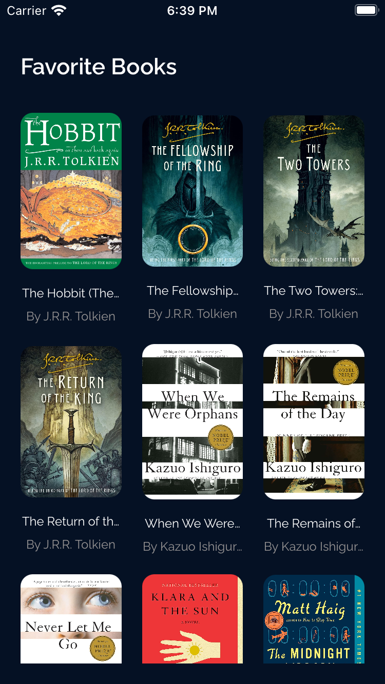
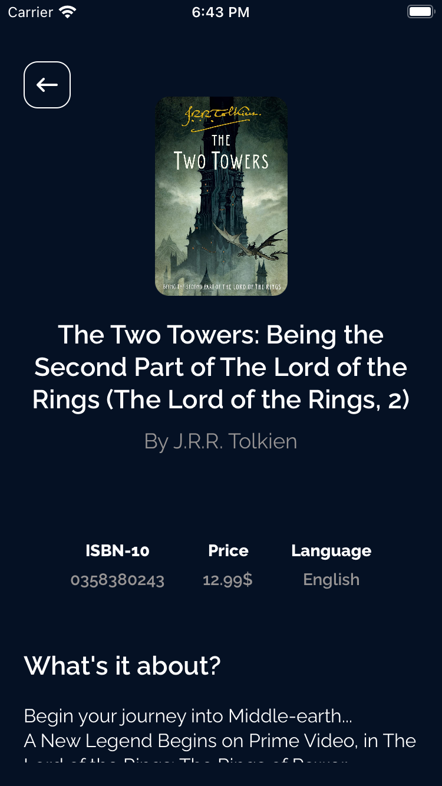

# Library 

A simple project with Swift UI. In this project, it displays a list of favorite books and the details of each one.

## Screenshots 🌃
favorite Books           |  Detail of Book  
:-------------------------:|:-------------------------:
|

## The tech stack used in this project 🛠

- SwiftUI
- MVVM + clean architecture
- Unit Test + MockURL
- async / await (Structured concurrency)
- Http client (Alamofire)

## Usage

1. Clone the repository:

  ``` bash
    git clone https://github.com/helloItsHEssam/Library.git
  ```

2. Clone the server repository and run it:

  ``` bash
    git clone https://github.com/helloItsHEssam/libraryServer.git
  ```

3. For more information about the server and how to run check the below link:

  ``` bash
    https://github.com/helloItsHEssam/libraryServer
  ```

###  Contributing 🤝

Contributions, issues, and feature requests are welcome! Feel free to fork the repository and submit a pull request with your changes.

## License

Please check [LICENSE](LICENSE) for details.